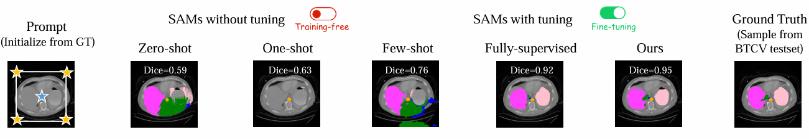

# DSFC: Deformation-Aware Learning Strategy via Self-sustaining Feedback Cycle for Medical Vision Foundation Model Domain Adaptation
Official PyTorch implementation of the paper "DSFC: Deformation-Aware Learning Strategy via Self-sustaining Feedback Cycle for Medical Vision Foundation Model Domain Adaptation" and the code will be coming soon. 🎈

## Overview

Vision foundation model, despite strong segmentation capabilities enabled by pretraining on large-scale data, remain underexplored in specific medical visual concept segmentation tasks. Medical imaging presents unique challenges: pixel intensity differences between target regions and surrounding structures are often subtle, and significant variations in the shape, size, and location of anatomical structures limit the effectiveness of traditional pixel-similarity-based alignment strategies. This paper proposes a Deformation-Aware Learning Strategy via Self-sustaining Feedback Cycle (DSFC) for medical image segmentation. The framework introduces a dual-deformation perturbation mechanism, combining global gaussian-distributed deformations and target-focused local deformations, to preserve anatomical patterns while capturing non-rigid variations. Hard Example Adaptive (HEA) loss is proposed to enhance training stability and mask accuracy. DSFC establishes a closed-loop training process, alternately optimizing the segmentation model and destroyer to improve anatomical understanding. Our extensive experiments on public datasets with various dimensions, organs demonstrate that DSFC significantly enhances model performance in fully supervised training settings without the need for increasing the samples. and its components are effective. 
